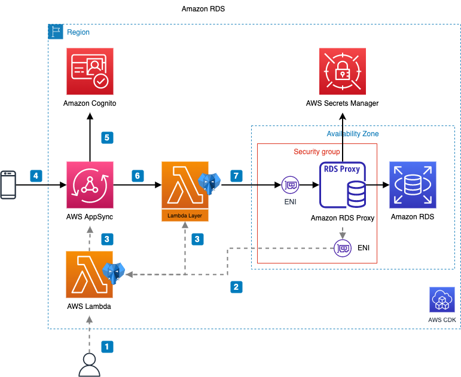

# Creating serverless GraphQL APIs from RDS databases with AWS AppSync and PostGraphile



This repo provides a CDK-based solution that allows you to create an [AWS AppSync](https://aws.amazon.com/appsync/) API from a defined Postgres database in AWS RDS.

This solution  leverages [PostGraphile](https://www.graphile.org/postgraphile/) to automatically generate an AppSync compliant schema from PostgreSQL tables, and uses Lambda functions to resolve GraphQL queries against a PostgreSQL database in [Amazon RDS](https://aws.amazon.com/rds/). The solution is serverless, and can be deployed in a few clicks. It uses the [AWS CDK](https://aws.amazon.com/cdk/), does not require writing any code, supports subscriptions, and works with any PostgreSQL database like [Amazon RDS for PostgreSQL](https://aws.amazon.com/rds/postgresql/) and [Amazon Aurora PostgreSQL](https://aws.amazon.com/rds/aurora/features/).

## Solution Overview

0. Start by deploying the CDK-based solution. The solution creates an AppSync API with a datasource that uses the resolver Lambda function, and an AppSync function that uses that datasource.
1. Once the solution is deployed, a user runs the `provider` function to analyze the RDS PostgreSQL database and generate the GraphQL schema. 
2. The `provider` function retrieves schema information from RDS database using Postgaphile
3. The `provider` updates the Layer function attached to the `resolver` Lambda function and updates the AppSync API. It updates the schema, and properly sets up the queries, mutations, and subscriptions. Note that a user can repeat step 1 at any time (e.g.: after a database schema change) to update the AppSync API definition.
4. The AppSync API is now ready to process requests. A GraphQL request is made.
5. AppSync authorizes the request using the configured Authorization Mode (API KEY, Cognito User Pool, etc...)
6. AppSync resolves the request by calling the attached Direct Lambda Resolver. The identity of the user is included in the request to the `resolver` Lambda function
7. The Lambda function resolves the query using the PostGraphile schema and RDS database

For more information about the solution and a detailed walk-through, please see the related [blog](http://todo).

## Getting Started

```sh
git clone https://github.com/aws-samples/appsync-with-postgraphile-rds.git
cd appsync-with-postgraphile-rds
npm install
```

## Deploying a VPC with RDS (optional step)

If you do not have an existing PostgreSQL RDS, the **vpc-with-pg** CDK app will deploy a VPC with public and private subnets with NAT Gateway and provision an RDS instance into the private subnet.

### Deploy the VPC

```sh
cd ./vpc-with-pg
npm run cdk deploy -- --all -O output.json
cd ..
```

### Loading the database (optional)

If you do not have an existing database schema and data, you can leverage the provided [schema](vpc-with-pg/lib/layers/pg-dbschema-layer/lib/dbschema.sql) to get started. You can load the schema and some data by using the [`dbschema.ts`](vpc-with-pg/lib/functions/dbschema.ts) lambda function that was deployed in the previous step.

**Note**: this lambda function also takes care of defining a database user `lambda_runner` (a user with restricted privileges) that will be used to execute all of our queries against the database.

The schema defines a `Person` and `Post` table inside a database called `forum_demo_with_appsync`

```sh
cd ./vpc-with-pg
npm run load
cd ..
```

### Clean up the VPC app

```sh
cd ./vpc-with-pg
npm run cdk destroy -- --all
```

## The solution

Deploy the solution into an existing vpc with RDS, or after **vpc-with-pg**.

### Requirements

To get started, you need the following to enable connections to our database:

* an RDS Postgres database
* an RDS Proxy associated with our RDS Postgres database
  * we use [AWS Identity and Access Management (IAM) authentication for databases](https://docs.aws.amazon.com/AmazonRDS/latest/AuroraUserGuide/rds-proxy.html)
  * and securely store credentials in AWS Secrets Manager.
* a [VPC Security Group](https://docs.aws.amazon.com/vpc/latest/userguide/VPC_SecurityGroups.html) that allows connection to our RDS Proxy

You will also need to know the following information about our Postgres database:

* database to connect to
* schema(s) of interest (containing our tables and functions)
* username/role to use to execute queries. This role should have the scoped-down privileges required to access the schema(s). See this [AWS blog](https://aws.amazon.com/blogs/database/overview-of-security-best-practices-for-amazon-rds-for-postgresql-and-amazon-aurora-postgresql-compatible-edition/) for more details on security best practices for Amazon RDS for PostgreSQL.

### Deploy the solution

Use the `deploy` script to deploy the CDK solution. The script uses values from **vpc-with-pg**'s `output.json` to configure the stacks context environment and variables.

```sh
git clone https://github.com/aws-samples/appsync-with-postgraphile-rds.git
cd appsync-with-postgraphile-rds
npm install

cd ./pg-with-graphile

REGION="<region>"
RDSPROXYNAME="<rdsproxyname>"
SECURITYGROUPID="<security-group-id>"
USERNAME="<username>"
DATABASE="<database>"
SCHEMAS="<schemas>"

npm run deploy -- --region $REGION --proxy $RDSPROXYNAME --sg $SECURITYGROUPID --username $USERNAME --database $DATABASE --schemas $SCHEMAS
```

For example, if you deployed **vpc-with-pg** along with the demo data provided, you would run the following command:

```bash
cd ./pg-with-graphile
npm run deploy -- --username lambda_runner --database forum_demo_with_appsync --schemas forum_example
```

After deployment, run the `update` script to update your API and create your schema cache layer

```bash
# in the `./pg-with-graphile` directory
npm run update
```

Done.

## Clean up the solution

When you are done with the solution, you can delete your resources by running the scripts below.

```sh
# in the `./pg-with-graphile` directory
cd ./pg-with-graphile
npm run cdk destroy
```
