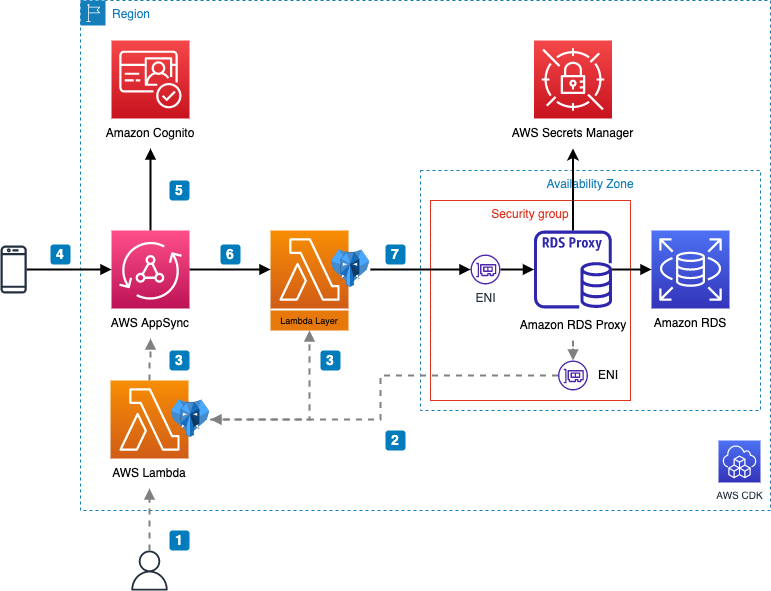

# Serverless auto-generated GraphQL API with AWS AppSync and PostGraphile

This repository provides an AWS CDK-based solution that creates an [AWS AppSync](https://aws.amazon.com/appsync/) GraphQL API from an existing PostgreSQL database in Amazon RDS. For a detailed walkthrough, see the AWS blog post [Creating serverless GraphQL APIs from RDS databases with AWS AppSync and PostGraphile](https://aws.amazon.com/blogs/mobile/creating-serverless-graphql-apis-from-rds-databases-with-aws-appsync-and-postgraphile/).

## Table of Contents
- [Solution Overview](#solution-overview)
- [Prerequisites](#prerequisites)
- [Deployment](#deployment)
  - [Getting Started](#getting-started)
  - [Option 1: Deploy with existing VPC and RDS](#option-1-deploy-with-existing-vpc-and-rds)
  - [Option 2: Deploy sample VPC and RDS first](#option-2-deploy-sample-vpc-and-rds-first)
  - [Configuration](#configuration)
- [Cleaning Up](#cleaning-up)

## Solution Overview


This solution uses [PostGraphile](https://www.graphile.org/postgraphile/) to automatically generate an AppSync-compliant schema from PostgreSQL tables. AWS Lambda functions resolve GraphQL queries against your PostgreSQL database in [Amazon RDS](https://aws.amazon.com/rds/). This serverless solution uses the [AWS CDK](https://aws.amazon.com/cdk/) for deployment without requiring custom code. It supports GraphQL subscriptions for real-time data updates and works with any PostgreSQL database, including [Amazon Aurora PostgreSQL](https://aws.amazon.com/rds/aurora/features/).

### How it Works

Deploy the CDK solution, which creates:
  - An AppSync GraphQL API
  - A `resolver` Lambda function as a data source
  - A `provider` Lambda function to introspect the database
  - Necessary IAM roles and permissions

1. Invoke the `provider` function to start the database introspection process

2. The `provider` function analyzes your PostgreSQL database and generates the GraphQL schema using PostGraphile

3. The `provider` function updates a Lambda Layer with cached schema information, configures the AppSync API schema, and attaches the `resolver` function to the queries, mutations, and subscriptions

**Note:** You can repeat step 1 at any time (e.g. after a database schema change) to update the AppSync API definition.

4. The AppSync API is now ready to process requests made by client applications. The AppSync API processes client requests by calling the Direct Lambda Resolver

5. AppSync authorizes the request using the configured [authorization type](https://docs.aws.amazon.com/appsync/latest/devguide/security-authz.html) (API KEY, Amazon Cognito user pool, etc.)

6. The AppSync API processes client requests by calling the Direct Lambda Resolver. The identity of the user is included in the request to the `resolver` Lambda function

7. The Lambda function resolves queries using PostGraphile and connects securely to RDS via [Amazon RDS Proxy](https://aws.amazon.com/rds/proxy/)

## Prerequisites

### Required Tools
- [Node.js 22.x+](https://nodejs.org/en)
- [Git](https://git-scm.com/downloads)
- [AWS CDK v2.204.0+](https://docs.aws.amazon.com/cdk/v2/guide/prerequisites.html)
- [AWS CLI 2.27+](https://docs.aws.amazon.com/cli/latest/userguide/cli-chap-getting-started.html)
  - [Authentication and access credentials for the AWS CLI](https://docs.aws.amazon.com/cli/latest/userguide/cli-chap-authentication.html)

### Required AWS Resources
- Amazon VPC with one or more private subnets with NAT Gateway
- VPC security groups allowing connections from the RDS proxy to the database and from Lambda to the proxy
- Amazon RDS for PostgreSQL or Amazon Aurora PostgreSQL database
- Amazon RDS Proxy associated with the PostgreSQL database
  - [AWS Identity and Access Management (IAM) authentication for databases](https://docs.aws.amazon.com/AmazonRDS/latest/AuroraUserGuide/rds-proxy.html)
  - Database credentials stored in [AWS Secrets Manager](https://docs.aws.amazon.com/AmazonRDS/latest/AuroraUserGuide/rds-proxy-secrets-arns.html)

## Deployment

### Getting Started

Clone the repository and install dependencies:

```bash
git clone https://github.com/aws-samples/appsync-with-postgraphile-rds.git
cd appsync-with-postgraphile-rds
npm install
```

### Configuration Setup

Before deploying, you need to create a `config.json` file in the `config/` directory. The configuration depends on your deployment scenario:

#### Option A: Using Existing VPC and RDS

For existing infrastructure, copy the template and fill in your values:

```bash
cp config/config.existing_resources.template.json config/config.json
```

Edit `config/config.json` with your existing AWS resources:

```json
{
    "rds_proxy_name": "the-proxy-identifier-name",
    "db_name": "your_database_name",
    "db_schemas": [
      "public",
      "your_schema"
    ],
    "db_username": "your_db_user",
    "vpc_id": "vpc-0123456789abcdef0",
    "sg_ids": [
        "sg-0123456789abcdef0"
    ]
}
```

**Field Descriptions:**
- `rds_proxy_name`: Name of your existing RDS Proxy
- `db_name`: Name of the PostgreSQL database to connect to
- `db_schemas`: Array of database schemas to introspect (e.g., "public,sales,inventory"). 
- `db_username`: Database username for query execution (should have limited privileges)
- `vpc_id`: ID of your existing VPC (format: `vpc-xxxxxxxxx`)
- `sg_ids`: Array of security group IDs that allow Lambda access to RDS Proxy

#### Option B: Deploy Sample VPC and RDS

For deploying sample infrastructure, choose one of the sample configurations:

**With sample data loading:**
```bash
cp config/config.sample_resources_sample_data.template.json config/config.json
```

Edit `config/config.json` for sample deployment:

```json
{
    "deploy_sample_resource": true,
    "load_sample_data": true
}
```


**With your own data (no sample data):**
```bash
cp config/config.sample_resources_own_data.template.json config/config.json
```

```json
{
    "deploy_sample_resources": true,
    "load_sample_data": false,
    "db_name": "your_database_name",
    "db_schemas": [
      "public",
      "your_schema"
    ],
    "db_username": "your_db_user"
}
```


**Field Descriptions:**
- `deploy_sample_resource`: Set to `true` to deploy sample VPC and RDS infrastructure
- `load_sample_data`: Set to `true` to load sample database schema and data or set to `false` to load your own data later
**the fields below are only required if providing your own data**
- `db_name`: Name of the PostgreSQL database to connect to
- `db_schemas`: Array of database schemas to introspect (e.g., "public,sales,inventory"). 
- `db_username`: Database username for query execution (should have limited privileges)


### Option 1: Deploy with existing VPC and RDS

If you have existing VPC and RDS resources, ensure your `config.json` is configured with your existing infrastructure (see Configuration Setup above), then deploy:

#### Deploy the Solution

```bash
# Deploy the AppSync solution using your existing infrastructure
npm run cdk deploy
```

After deployment, update your API and create the schema cache:

```bash
npm run update
```

### Option 2: Deploy sample VPC and RDS with the AppSync Solution

If you don't have existing VPC and RDS resources, ensure your `config.json` is configured for sample deployment (see Configuration Setup above), then deploy:

This creates:
- A VPC with public and private subnets and NAT Gateway
- A PostgreSQL RDS instance with RDS Proxy
- Sample database schema with `Person` and `Post` tables in the `forum_demo_with_appsync` database (if `load_sample_data` is true)
- AppSync GraphQL API with PostGraphile integration


#### Deploy Sample Infrastructure and AppSync Solution

```bash
# Deploy all stacks (VPC, RDS, and AppSync)
npm run cdk deploy
```


If you do not have an existing database schema and data, you can leverage the provided [sample data](lib/functions/sample-db-setup/dbschema.sql) to get started.

```bash
# Load sample data into the database (for sample deployments)
npm run load-data
```


After deployment, update your API and create the schema cache:
```bash
npm run update
```

### Advanced Configuration

#### Passing Custom Settings

The solution passes the caller's [identity](https://docs.aws.amazon.com/en_us/appsync/latest/devguide/resolver-context-reference.html#aws-appsync-resolver-context-reference-identity) to [`pgSettings`](https://www.graphile.org/postgraphile/usage-library/#pgsettings-function). You can pass additional data by setting your own `pgSettings` values in your AppSync pipeline resolver. To do this, attach your own Appsync function to your resolver and add your `pgSettings` object to the stash. Note that the `PG_CONNECTOR_FN` function must be the last function executed.


Example mapping template:

```vtl
$util.quiet($ctx.stash.put("pgSettings", {
  "some": "value", 
  "domainName": $ctx.request.domainName, 
  "nested": {"sub": "lower level setting"}
}))
{
  "payload": {}
}
```

Response template:

```vtl
{}
```

The solution automatically flattens objects and adds the prefix `appsync.` to all keys:

```json
{
  "appsync.domainName": "my.domain.com",
  "appsync.some": "value",
  "appsync.nested_sub": "lower level setting"
}
```

#### Updating After Database Schema Changes

Update your GraphQL schema after database changes:

```bash
npm run update
```

This updates the schema and configures any new resolvers. Existing resolvers remain unchanged.


#### Available Scripts

The project includes several TypeScript scripts for common operations:

```bash
# Load sample data into the database (for sample deployments)
npm run load-data

# Update GraphQL schema from database changes
npm run update

# Clean up sample data from the database
npm run cleanup-data
```

**Script Details:**
- `load-data`: Invokes the database schema handler to load sample forum data (Person and Post tables)
- `update`: Invokes the schema provider to regenerate GraphQL schema from current database structure
- `cleanup-data`: Removes sample data from the database while preserving structure

### Troubleshooting

#### Common Configuration Issues

1. **Invalid config.json format**: Ensure your JSON syntax is correct and all required fields are present
2. **VPC/Security Group access**: Verify that your security groups allow Lambda functions to access RDS Proxy on port 5432
3. **RDS Proxy configuration**: Ensure your RDS Proxy is configured with IAM authentication and has the correct database credentials in Secrets Manager
4. **Database connectivity**: Test that your database is accessible from the VPC subnets specified in your security groups

#### Validation Errors

- **VPC ID format error**: VPC IDs must follow the pattern `vpc-` followed by 8 or 17 alphanumeric characters
- **RDS Proxy ARN format error**: Must be a valid RDS Proxy ARN format
- **Missing required fields**: Ensure all required fields are present based on your deployment type (existing vs. sample infrastructure)

#### Deployment Issues

- **CDK bootstrap required**: Run `npm run cdk bootstrap` if you haven't bootstrapped CDK in your region
- **IAM permissions**: Ensure your AWS credentials have sufficient permissions to create the required resources
- **Resource limits**: Check your AWS account limits for Lambda functions, VPC resources, and RDS instances

## Project Structure

```
├── bin/                          # CDK application entry points
│   └── appsync-with-postgraphile.ts
├── config/                       # Configuration files
│   ├── config.json              # Your deployment configuration
│   ├── config.existing_resources.template.json
│   ├── config.sample_resources_sample_data.template.json
│   └── config.sample_resources_own_data.template.json
├── lib/                         # CDK stack definitions and utilities
│   ├── stacks/                  # CDK stack definitions
│   │   ├── appsync-with-postgraphile-stack.ts  # Main AppSync stack
│   │   ├── pg-vpc-stack.ts     # VPC stack (optional)
│   │   ├── pg-rds-stack.ts     # RDS stack (optional)
│   │   ├── pg-schema-stack.ts  # Schema setup stack (optional)
│   │   └── helper.ts           # Configuration validation utilities
│   ├── functions/              # Lambda function code
│   │   ├── query-resolver/     # GraphQL query resolver
│   │   ├── schema-provider/    # Schema generation and caching
│   │   └── sample-db-setup/    # Sample database setup
│   ├── layers/                 # Lambda layers
│   │   ├── pg-as-datasource-layer/    # PostGraphile dependencies
│   │   └── pg-dbschema-layer/         # Database schema utilities
│   ├── graphql/                # GraphQL schema and resolvers
│   │   ├── schema/
│   │   └── resolvers/
│   └── utils/                  # Utility functions
├── scripts/                    # TypeScript utility scripts
│   ├── load_data.ts           # Load sample data into database
│   ├── update.ts              # Update GraphQL schema
│   └── cleanup_data.ts        # Clean up sample data
└── package.json               # Unified package configuration
```

## Cleaning Up

Remove all deployed resources when you are finished with the solution:

### If you deployed with existing VPC and RDS:

```bash
# Remove all stacks at once
npm run cdk destroy --all
```

**Note**: The RDS stack may take several minutes to delete due to the database deletion process.
